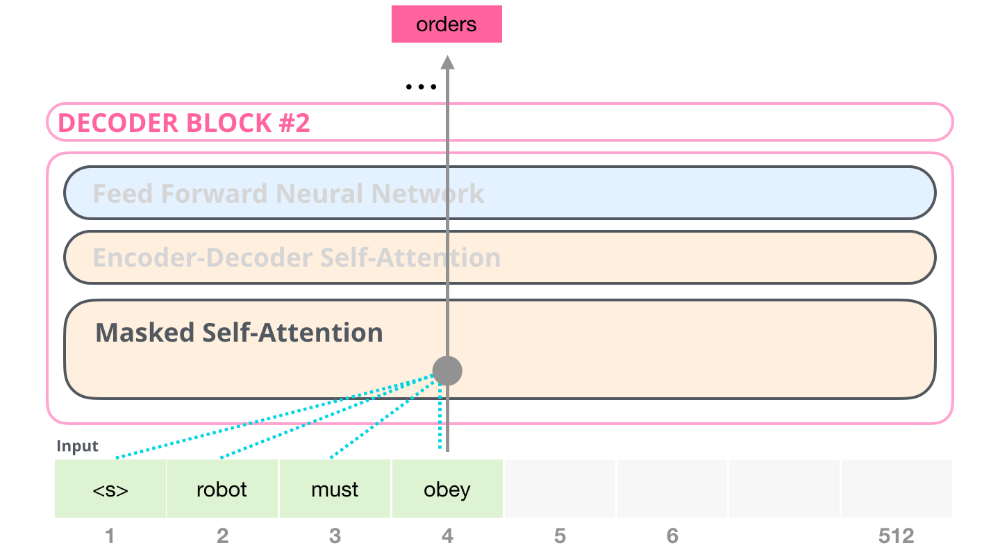

# chatgpt

simple decoder-only GTP model in pytorch



## 依赖

```
pip install tqdm torch==2.1.2 torchvision==0.16.2 torchaudio==2.1.2 --index-url https://download.pytorch.org/whl/cu118  -i https://mirrors.aliyun.com/pypi/simple/
```

## 配置（config.py）

GPT_MODE可选值为generate或者chat，切换模式后需要重新构建dataset.

generate：使用诗体直接训练，即单词接龙风格

```
谢却荼蘼，一片月明如水
篆香消，犹未睡，早鸦啼
嫩寒无赖罗衣薄，休傍阑干角
最愁人，灯欲落，雁还飞
```

chat：使用chatml格式训练，其中user是诗标题，assitant是诗体，即对话风格（指定诗标题，自动写诗体）

```
<|im_start|>user
酒泉子·谢却荼蘼
<|im_end|>
<|im_start|>assistant
谢却荼蘼，一片月明如水
篆香消，犹未睡，早鸦啼
嫩寒无赖罗衣薄，休傍阑干角
最愁人，灯欲落，雁还飞
<|im_end|>
```

## 训练

训练tokenizer

```
python train_tokenizer.py
```

构建dataset

```
python build_dataset.py
```

训练gpt

```
python train_gpt.py
训练集大小: 258
100%|█████████████████████████████████████████████████████████████████████████████████████████████████████████████████████████████| 10000/10000 [19:04<00:00,  8.74it/s, loss=0.0698]
```

# 推理

GPT_MODE='generate'模式，效果为单词接龙.

```
python inference.py
>山色江声共寂寥
< 山色江声共寂寥，十三陵树晚萧萧
中原事业如江左，芳草何须怨六朝
>三眠
< 三眠未歇，乍到秋时节
一树料阳蝉更咽，曾绾灞陵离别
絮己为萍风卷叶，空凄切
长条莫轻折，苏小恨，倩他说
尽飘零、游冶章台客
红板桥空，湔裙人去，依旧晓风残月
```

GPT_MODE='chat'模式，效果为对话（本质仍旧是单词接龙，只是由于数据构造为chatml格式）.

```
python inference.py
>虞美人·曲阑深处重相见
< <|im_start|>user
虞美人·曲阑深处重相见
<|im_end|>
<|im_start|>assistant
曲阑深处重相见，匀泪偎人颤
凄凉别后两应同，最是不胜清怨月明中
半生已分孤眠过，山枕檀痕涴
忆来何事最销魂，第一折枝花样画罗裙
>美人
< <|im_start|>user
美人
<|im_end|>
<|im_start|>assistant
落�垒鸟入闵，望舞，�端缕风毸山行山
西风丝，�茼�上�
炬
残阳何时节�已教�下雨霜倦
残阳郎此但，寄银入�成�作清�曾游
```

由于训练数据太小已过拟合，上述�表示模型返回bytes序列包含无法反解的utf-8序列，属于可预期现象。